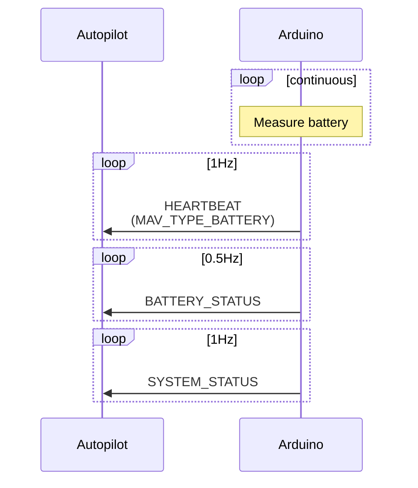

# Arduino MAVLink battery protocol

**Goal:** Implement battery status reporting protocol

## Communications

## Sources
- Battery protocol: https://mavlink.io/en/services/battery.html
- BATTERY_STATUS message: https://mavlink.io/en/messages/common.html#BATTERY_STATUS
- SYSTEM_STATUS message: https://mavlink.io/en/messages/common.html#SYS_STATUS
- HEARTBEAT message: https://mavlink.io/en/messages/common.html#HEARTBEAT
