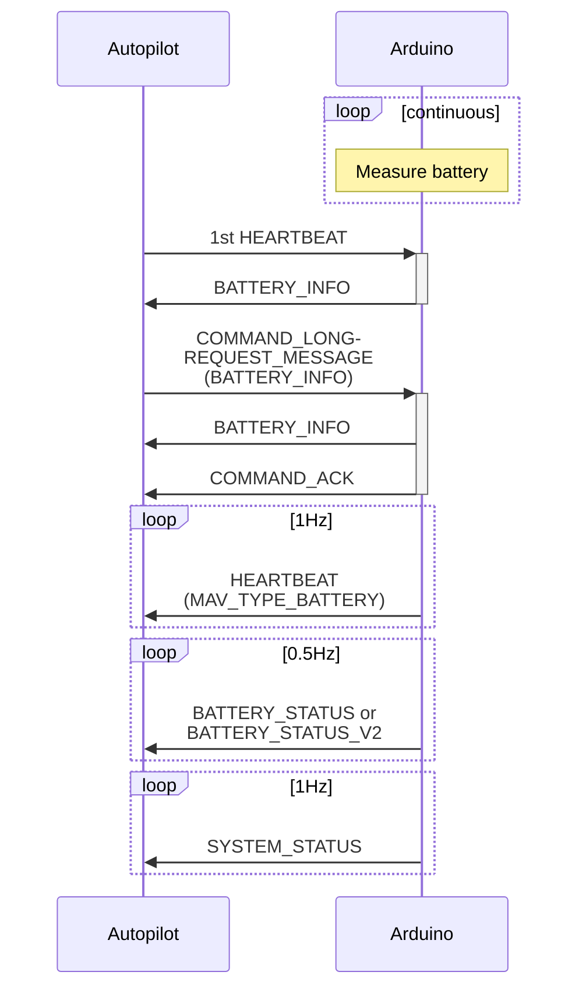

# Arduino MAVLink battery protocol (DEV version)

**Goal:** Implement battery status reporting protocol in it's entirety (including WIP messages)

## Communications

## Sources
- Battery protocol: https://mavlink.io/en/services/battery.html
- Command protocol: https://mavlink.io/en/services/command.html
- BATTERY_STATUS message: https://mavlink.io/en/messages/common.html#BATTERY_STATUS
- BATTERY_STATUS_V2 message: https://mavlink.io/en/messages/development.html#BATTERY_STATUS_V2
- SYSTEM_STATUS message: https://mavlink.io/en/messages/common.html#SYS_STATUS
- COMMAND_LONG message: https://mavlink.io/en/messages/common.html#COMMAND_LONG
- COMMAND_ACK message: https://mavlink.io/en/messages/common.html#COMMAND_ACK
- REQUEST_MESSAGE command: https://mavlink.io/en/messages/common.html#MAV_CMD_REQUEST_MESSAGE
- BATTERY_INFO message: https://mavlink.io/en/messages/common.html#BATTERY_INFO
- HEARTBEAT message: https://mavlink.io/en/messages/common.html#HEARTBEAT
