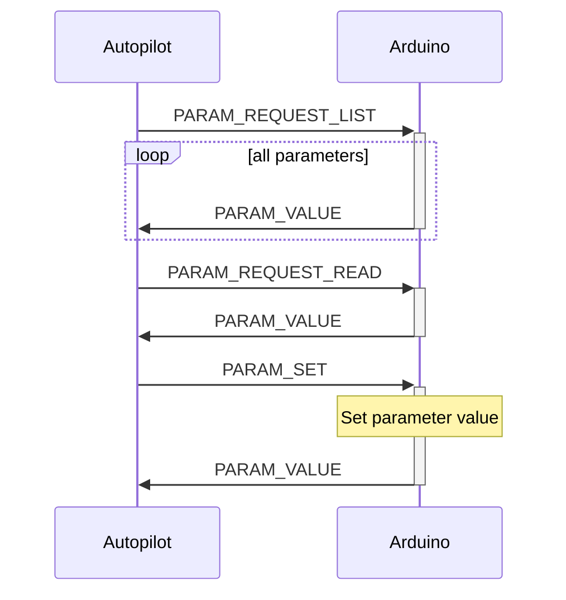

# Arduino MAVLink parameter protocol

**Goal:** Implement parameter protocol - Sync 3 new INT32 parameters with the Autopilot: AR_PARAM1, AR_PARAM2 and AR_PARAM3

## Communications

## Nuances

Notice that the `param_index` is a `uint16_t` in the PARAM_VALUE message, but an `int16_t` in the PARAM_REQUEST_READ message, because it has the option to be -1 in the latter if it wants the parameter by name.

This could cause a situation where the Arduino reports a new parameter with an index that is greater than `INT16_MAX` with a PARAM_VALUE message, and then the Autopilot can't ask for it's value by index because the index doesn't fit into the `param_index` field of the PARAM_REQUEST_READ message.

This doesn't block the Autopilot to ask for the parameter's value by name with the PARAM_REQUEST_READ message, or all the parameters, regardless of indexes or names with the PARAM_REQUEST_LIST message.

Due to this discrepancy, `int32_t` variables are used in some places in the example, with appropriate casts where they are used. Make sure not to define more than 32767 new paramemers to avoid any issues.

## Sources
- Parameter protocol: https://mavlink.io/en/services/parameter.html
- PARAM_REQUEST_LIST message: https://mavlink.io/en/messages/common.html#PARAM_REQUEST_LIST
- PARAM_REQUEST_READ message: https://mavlink.io/en/messages/common.html#PARAM_REQUEST_READ
- PARAM_SET message: https://mavlink.io/en/messages/common.html#PARAM_SET
- PARAM_VALUE message: https://mavlink.io/en/messages/common.html#PARAM_VALUE
- HEARTBEAT message: https://mavlink.io/en/messages/common.html#HEARTBEAT
