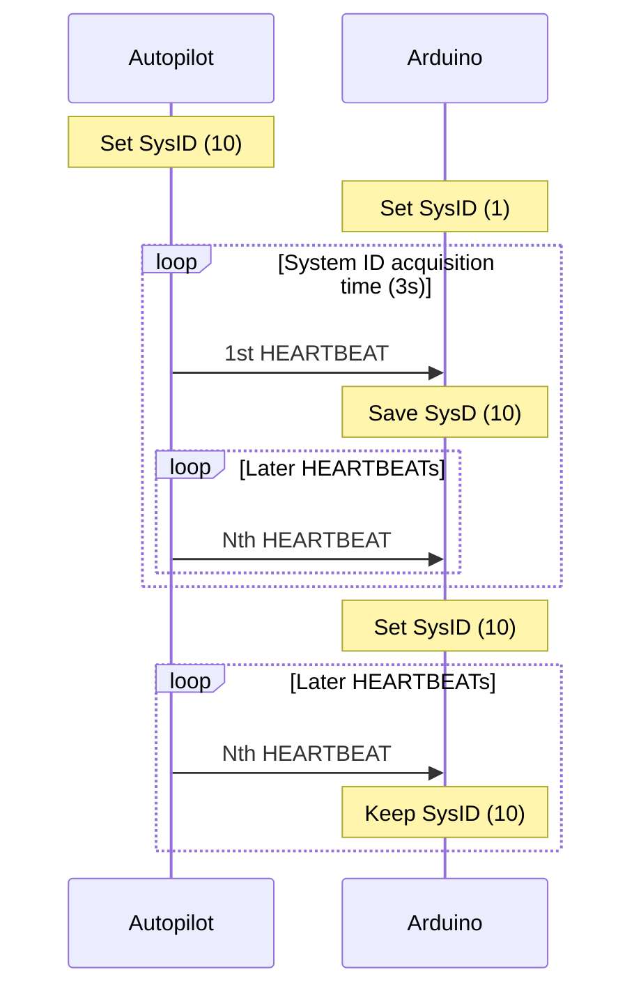
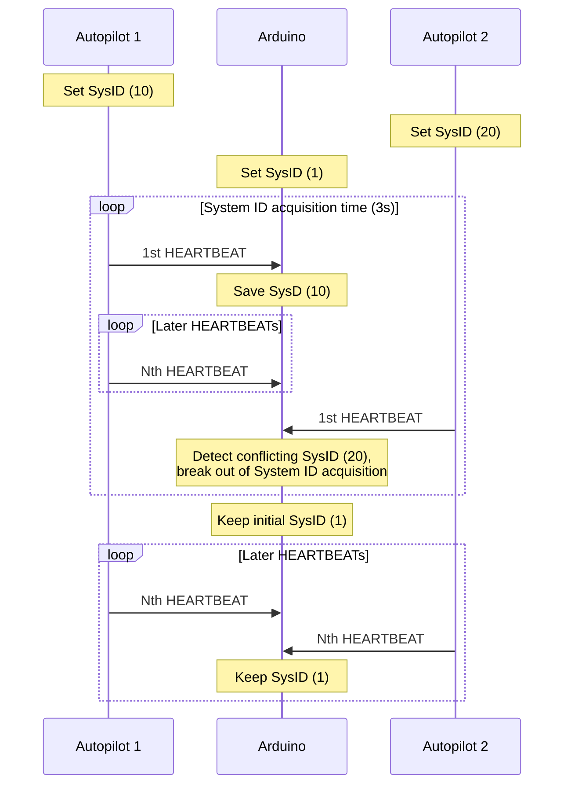

# Arduino MAVLink System ID assignment protocol

**Goal:** Implement System ID assignment - "Steal" the System ID from the Autopilot HEARTBEAT message

## Case 1: Single Autopilot in the system

## Case 2: Multiple Autopilots in the system (System ID conflict)

## Sources
- ID assignment protocol: https://mavlink.io/en/services/mavlink_id_assignment.html
- HEARTBEAT message: https://mavlink.io/en/messages/common.html#HEARTBEAT
