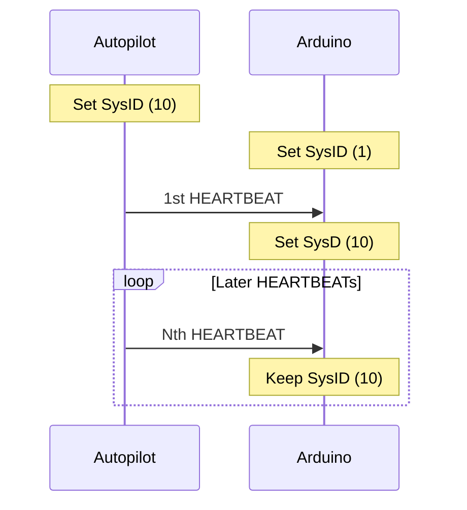

# Arduino MAVLink System ID assignment protocol (simple version)

**Goal:** Implement simple System ID assignment - "Steal" the System ID from the Autopilot HEARTBEAT message

## Communications

## Sources
- ID assignment protocol: https://mavlink.io/en/services/mavlink_id_assignment.html
- HEARTBEAT message: https://mavlink.io/en/messages/common.html#HEARTBEAT
